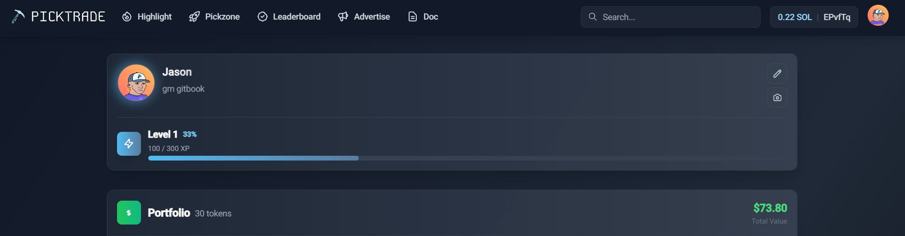

# Gamify trading

While Pick Trade has the ambition to become a global trading platform, one of the main focuses is to **gamify the trading experience**. Trading tokens and interacting with smart contracts need to be easier, more fun and more attractive.

The approach must be the same as how video games are seen today.

## Customization

Some aspects of the platform are customizable such as the profile section. Each user can create and customize their own **avatar** with a variety of accessories. Some of these are available from the start, while others must be unlocked.

Similar to most video games, you need to earn XP and advance through levels by interacting more with the platform and completing achievements to unlock additional assets.

<figure><figcaption></figcaption></figure>

## Earning

The points-earning system is based on on-chain interactions. For each transaction made on [Pick.trade](https://pick.trade/), users will **earn XP** which are added to their profiles. At specific milestones, users will advance to a higher level. With each level gained, new perks, accessories and [incentives](../the-token/incentives.md) become unlockable.

We also introduce the concept of **Badges**, which can be earned by reaching specific achievements. Each badge grants XP and additional rewards. These badges can be obtained by completing various on-chain or off-chain tasks, such as inviting 10 friends or creating a token on the platform.

<figure><figcaption></figcaption></figure>

## Social Network

Expanding user interaction on the platform, the system incorporates a **dynamic social network** feature.

Users can showcase their avatars, display earned badges and share their achieved levels. This profile visibility enables members to explore each other's progress including PnL statistics and trading history.

It creates an engaging community environment where achievements are publicly recognized, offering users the opportunity to learn from successful traders. Such integration of social elements into the trading platform not only enhances user experience but also adds a layer of motivation and learning.

***

_Integrating incentives and gamification into a trading platform is crucial. Therefore, we will continue to expand these features and focus on making the trading experience more enjoyable for users on-chain._
