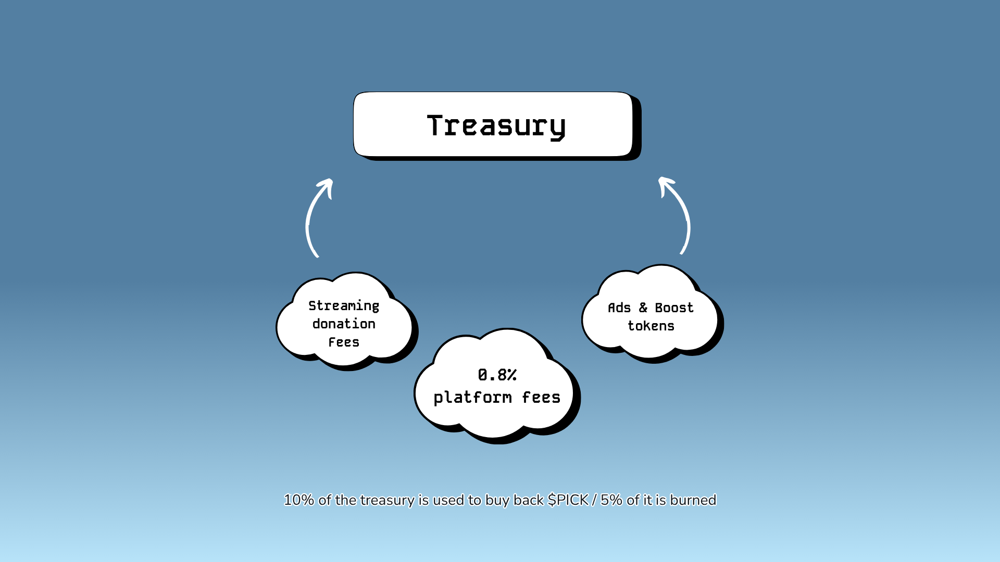

# Treasury

Pick Trade adopts a unique revenue model and deflationary mechanism to enhance its platform's sustainability and user engagement. The treasury, holding a mix of $PICK and $SOL tokens, not only fuels the platform's various features but is also crucial for the [deflationary strategy](./).&#x20;

<figure><figcaption></figcaption></figure>

The treasury is funded by revenue generated from:&#x20;

* Fees paid by users (traders & token creators).
* Premiums from advertisements and boosted tokens.
* Donation fees from [video live-streams](../../the-platform/video-live-streams/).

Every week, 10% of revenue is designated for buying back $PICK tokens, with half of this amount **burned** to reduce supply, while the other half strengthen the rewards vault, enhancing incentives for users participating in [gamified program](../../the-platform/images-and-media.md), contests and giveaways.&#x20;

This mechanism creates a deflationary system and generates steady **buying pressure** over time. If treasury contributions significantly increase, the team will arrange additional giveaways and contests for the community.
